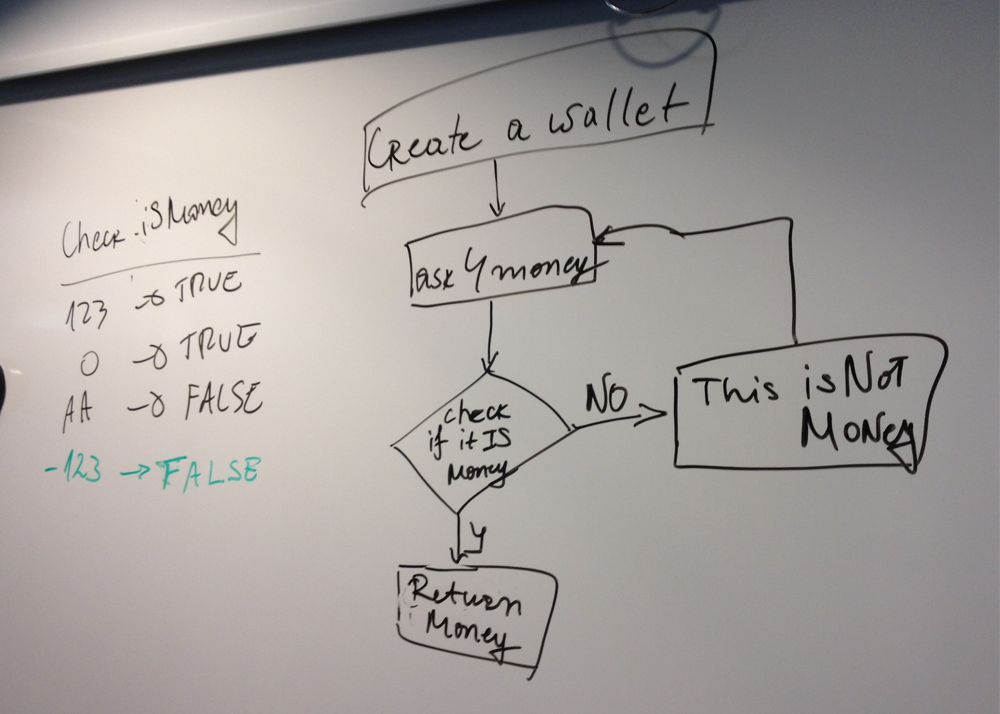
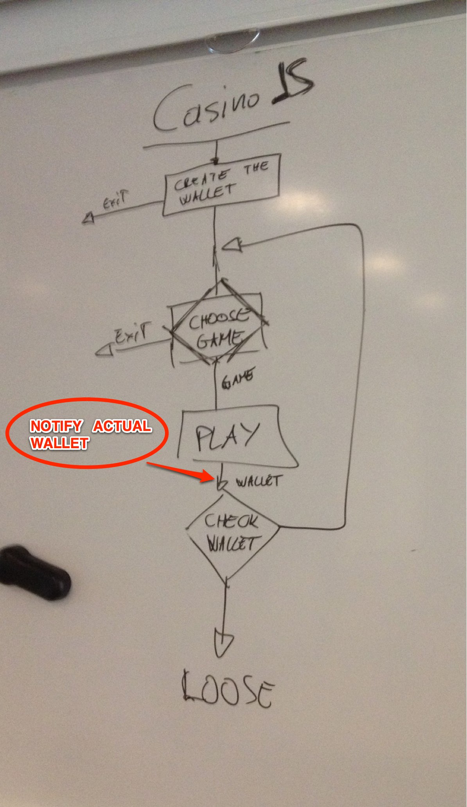

# CasinoJS - Main User Interaction
----------------------------------

This step is about to give a little life to our application, to make the big picture working with the user in front of the screen.

> We use just `alert()` and `prompt()` as UI so we still can focus 
> on application and architectural problems instead of web UI!

In this step we need to implement some functions that are just fakes right now:

- `createTheWallet()`
- `chooseUserAction()`
- exit strategies messages (just alert instead of console.log)

## Create The Wallet

Our first duty is to turn the fake wallet creation function into a real stuff.

    function createTheWallet() {
        return 50;
    }
    
Above implementation is all but a user interaction enabled function!

The best approach is to **consider the function an application per se** so then we can apply the very same approach we uset to CasinoJS: 

**we draw a functional schema!**

Our first naive implementation should be something similar to:

    function createTheWallet() {
        var wallet = parseInt(prompt('How much do you want to play?'));
        if (isNaN(wallet) || wallet < 0) {
            alert('Invalid input!');
            return createTheWallet();
        }
        return wallet;
    }

Once we're done with this development we run to do a manual test and everything works just fine.

### How Unit Testing improves code quality

If we take a better look to the schema we draw we can observe that the annotation on the left hand side is a perfect source for unit tests assertions.

But how can we test it? The functions takes no arguments so we have no simple ways to work with this function. 

> What we really need is to make the **`prompt()` function to 
> change it's behaviour** and return a test specific value!

This is something that we can do in Javascript, it is an advance unit testing technique and there are libraries that helps in doing that ([SinonJS](http://sinonjs.org)).

So far we have no such skills but we can follow a more easy path and simply **increase our code quality to meet the unit testing needs**.

The `createTheWallet()` function as it is implemented right now encapsulate two responsibilities:

- UI - dealing with the user 
- Data Validation

This is a great **break of the [Single Responsibility Principle](http://en.wikipedia.org/wiki/Single_responsibility_principle)** and we want to fight this bad behaviour in our code!

> We tried to do Unit Testing and it turned out **to hightlight a bad
> implementation** of our solution!

This is only one of the way that Unit Testing improves code quality!

### Refactoring to meet Unit Testing

We seriously **strive to follow the Single Responsibility Principle** so we pick up one of the above listed responsibilities and we **implement it in isolation**:

    function checkWalletInput(input) {
        var wallet = parseInt(input);
        if (isNaN(wallet) || wallet < 0) {
            return false;
        }
        return wallet;
    }
    
The code above **implements the validation responsibility** and it turn out to be a really simple and clear implementation which takes an input and returns an output: **it's the perfect candidate for Unit Testing**:

    assert(checkWalletInput(0) === 0, "wallet can be a zero value");
    assert(checkWalletInput(1) === 1, "wallet can be a positive number");
    assert(checkWalletInput(NaN) === false, "wallet can't be a NaN");
    assert(checkWalletInput('string') === false, "wallet can't be a string");

At this point we can implement the UI responsibility like this:

    function createTheWallet() {
        var wallet = checkWalletInput(prompt('How much ... ?'));
        if (wallet !== false) {
            return wallet;    
        }
        alert('invalid input!');
        return createTheWallet();
    }

This function **still be really hard to unit test** because takes no arguments and it is also recursive (she calls itself for an unpredictable amount of times). 

What we do realise is that **we don't really need to test this function (now)** because she depends on Javascript native funcitons and operators plus our `checkWalletInput()` which is fully unit testes!

## Choose The User Action

We can put in action all the reasoning we did for _Create The Wallet_ to work on this problem and **build a well structured and unit tested implementation**.

Now I want to share with you what happened to me, experienced developer, while implementing this particular function which is, so to speak, a ridicolous easy stuff (for a twelve years of experience developer!)

> **I really went crazy!**  
> and it turn out to be a "big picture schema" bad mistake!

I build the function with it's Single Responsibility Principle implementation side functions, everything was unit tested and seemed to work just fine.

**Then I did a manual test:**

1. I give a bad input to the prompt and I receive a "bad input" alert as expected.
2. I give a correct input to the prompt and I expect to move on with the game but I just receive the choiche prompt again. **Why???**

I seriously went crazy, I ran the unit tests again and they was ok, I filled of `console.log` every empty line just to see what was going on and everything was fine...

After a period of time which I will not tell for self respect reasons I understood that everything was just working fine! **My expectations were just wrong!**

In this step we are implementing the UI but the `playTheGame()` implementation still a fake that just makes the user to loose 10 chips each time.

If I play with a wallet of 20 chips and I choose to play the correct game (test) then I loose 10 chips but I still have the right to play so `playLoop()` give me another chance to choose something.

> If I was playing 100 chips I was running `chooseUserAction()` 
> 10 times before to quit the game!

**The simple solution is** just to add a UI message after each game confirming the user the wallet status after he has played the game.

---

**!!! A GOOD SCHEMA SAVES A LOT OF HEADACHES !!!**

---

